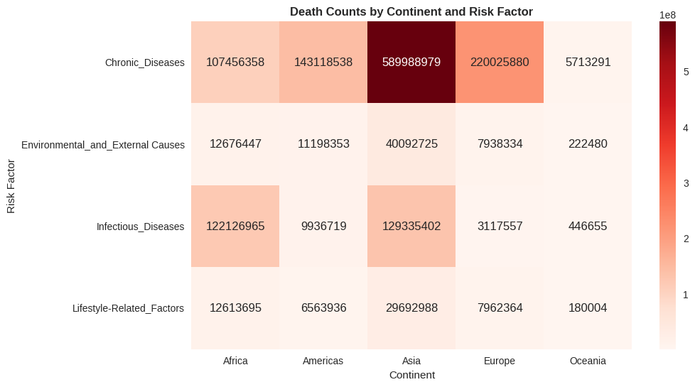
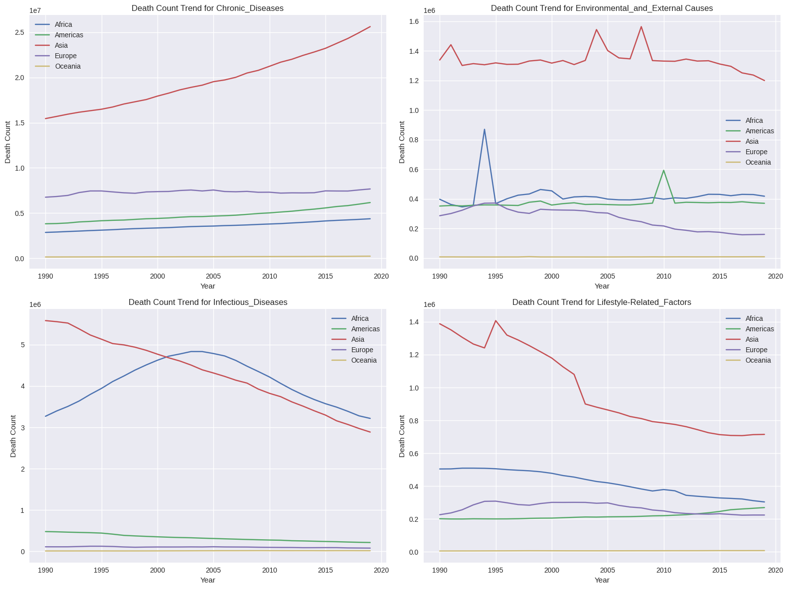
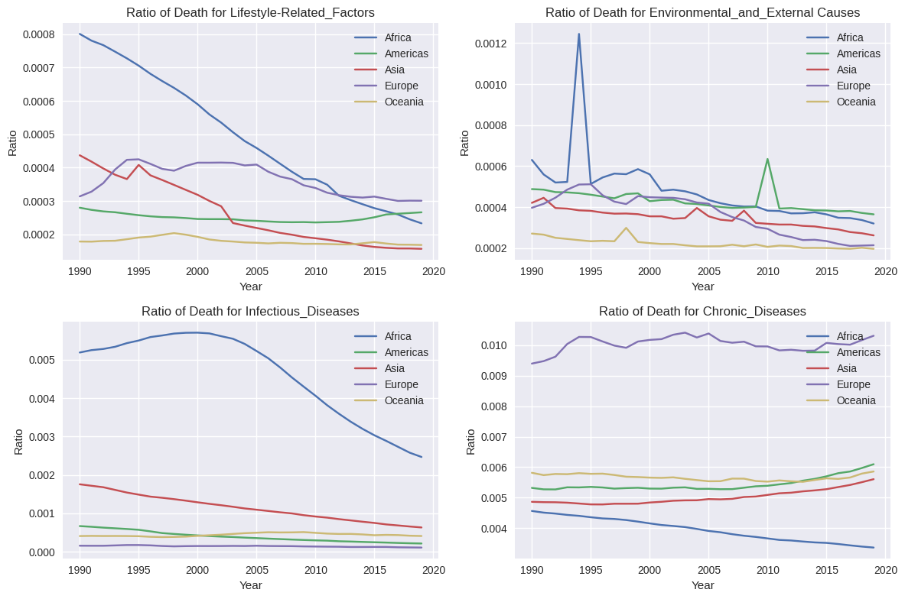
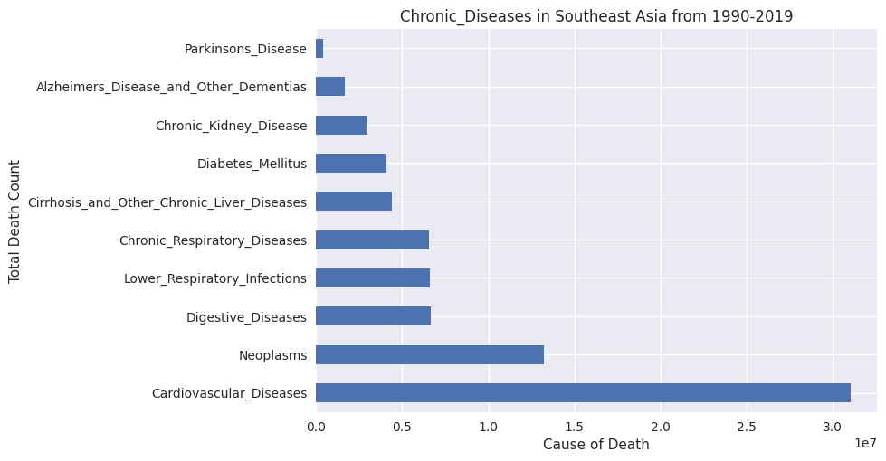
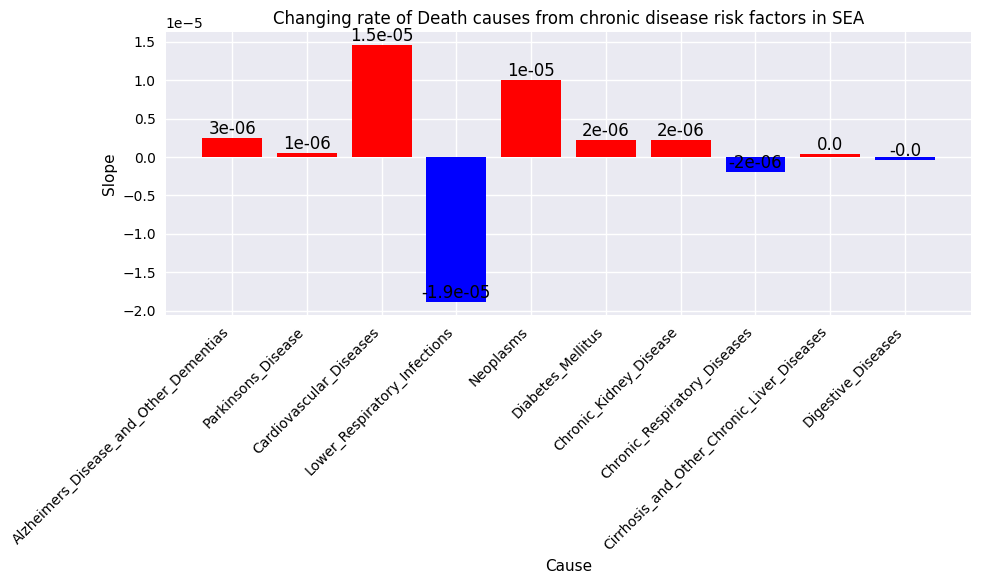
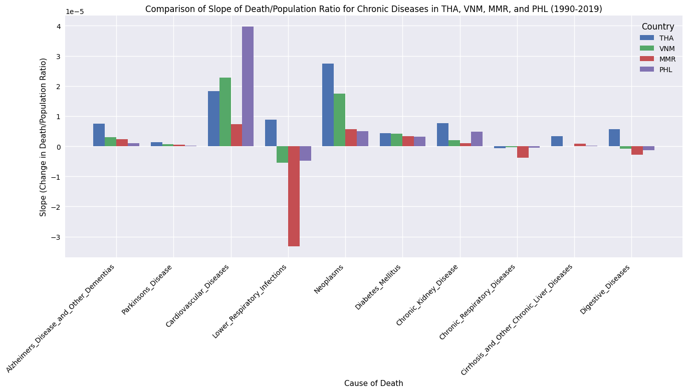

<h1>[DADS5001] Mini Project - Living death - [Death Cause Analysis] </h1>

<!-- TABLE OF CONTENTS -->
<details>
  <summary>Table of Contents</summary>
  <ol>
    <li>
      <a href="#group-by-4-risk-factor">Group by 4 Risk Factor</a>
      <ul>
        <li><a href="#adding-percentage-columns">Adding percentage columns</a></li>
        <li><a href="#heatmap-of-risk-factor-and-continent">Heatmap of Risk Factor and continent</a></li>
        <li><a href="#trends-of-death-count-overyears">Trends of Death count overyears</a></li>
        <li><a href="#south-eastern-asia">South-Eastern Asia</a></li>
      </ul>
    </li>
  </ol>
</details>

## Group by 4 Risk Factor

Manualy Grouping

```python
# List of diseases grouped by categories
grouped_diseases = {
    "Lifestyle-Related_Factors": [
        "Nutritional_Deficiencies",
        "Drug_Use_Disorders",
        "Alcohol_Use_Disorders",
        "Self_harm",
        "Protein_Energy_Malnutrition"
    ],
    "Environmental_and_External Causes": [
        "Drowning",
        "Interpersonal_Violence",
        "Exposure_to_Forces_of_Nature",
        "Conflict_and_Terrorism",
        "Road_Injuries",
        "Environmental_Heat_and_Cold_Exposure",
        "Poisonings",
        "Fire_Heat_and_Hot_Substances"
    ],
    "Infectious_Diseases": [
        "Meningitis",
        "Malaria",
        "HIV",
        "Tuberculosis",
        "Neonatal_Disorders",
        "Diarrheal_Diseases",
        "Acute_Hepatitis"
    ],
    "Chronic_Diseases": [
        "Alzheimers_Disease_and_Other_Dementias",
        "Parkinsons_Disease",
        "Cardiovascular_Diseases",
        "Lower_Respiratory_Infections",
        "Neoplasms",
        "Diabetes_Mellitus",
        "Chronic_Kidney_Disease",
        "Chronic_Respiratory_Diseases",
        "Cirrhosis_and_Other_Chronic_Liver_Diseases",
        "Digestive_Diseases"
    ]
}

# Convert dictionary to pandas DataFrame
df_grouped_diseases = pd.DataFrame([(category, disease) for category, diseases in grouped_diseases.items() for disease in diseases], columns=["Risk_Factor", "Cause"])

df_grouped_diseases

```
<table border="1" class="dataframe">
  <thead>
    <tr style="text-align: right;">
      <th></th>
      <th>Risk_Factor</th>
      <th>Cause</th>
    </tr>
  </thead>
  <tbody>
    <tr>
      <th>0</th>
      <td>Lifestyle-Related_Factors</td>
      <td>Nutritional_Deficiencies</td>
    </tr>
    <tr>
      <th>1</th>
      <td>Lifestyle-Related_Factors</td>
      <td>Drug_Use_Disorders</td>
    </tr>
    <tr>
      <th>2</th>
      <td>Lifestyle-Related_Factors</td>
      <td>Alcohol_Use_Disorders</td>
    </tr>
    <tr>
      <th>3</th>
      <td>Lifestyle-Related_Factors</td>
      <td>Self_harm</td>
    </tr>
    <tr>
      <th>4</th>
      <td>Lifestyle-Related_Factors</td>
      <td>Protein_Energy_Malnutrition</td>
    </tr>
    <tr>
      <th>5</th>
      <td>Environmental_and_External Causes</td>
      <td>Drowning</td>
    </tr>
    <tr>
      <th>6</th>
      <td>Environmental_and_External Causes</td>
      <td>Interpersonal_Violence</td>
    </tr>
    <tr>
      <th>7</th>
      <td>Environmental_and_External Causes</td>
      <td>Exposure_to_Forces_of_Nature</td>
    </tr>
    <tr>
      <th>8</th>
      <td>Environmental_and_External Causes</td>
      <td>Conflict_and_Terrorism</td>
    </tr>
    <tr>
      <th>9</th>
      <td>Environmental_and_External Causes</td>
      <td>Road_Injuries</td>
    </tr>
    <tr>
      <th>10</th>
      <td>Environmental_and_External Causes</td>
      <td>Environmental_Heat_and_Cold_Exposure</td>
    </tr>
    <tr>
      <th>11</th>
      <td>Environmental_and_External Causes</td>
      <td>Poisonings</td>
    </tr>
    <tr>
      <th>12</th>
      <td>Environmental_and_External Causes</td>
      <td>Fire_Heat_and_Hot_Substances</td>
    </tr>
    <tr>
      <th>13</th>
      <td>Infectious_Diseases</td>
      <td>Meningitis</td>
    </tr>
    <tr>
      <th>14</th>
      <td>Infectious_Diseases</td>
      <td>Malaria</td>
    </tr>
    <tr>
      <th>15</th>
      <td>Infectious_Diseases</td>
      <td>HIV</td>
    </tr>
    <tr>
      <th>16</th>
      <td>Infectious_Diseases</td>
      <td>Tuberculosis</td>
    </tr>
    <tr>
      <th>17</th>
      <td>Infectious_Diseases</td>
      <td>Neonatal_Disorders</td>
    </tr>
    <tr>
      <th>18</th>
      <td>Infectious_Diseases</td>
      <td>Diarrheal_Diseases</td>
    </tr>
    <tr>
      <th>19</th>
      <td>Infectious_Diseases</td>
      <td>Acute_Hepatitis</td>
    </tr>
    <tr>
      <th>20</th>
      <td>Chronic_Diseases</td>
      <td>Alzheimers_Disease_and_Other_Dementias</td>
    </tr>
    <tr>
      <th>21</th>
      <td>Chronic_Diseases</td>
      <td>Parkinsons_Disease</td>
    </tr>
    <tr>
      <th>22</th>
      <td>Chronic_Diseases</td>
      <td>Cardiovascular_Diseases</td>
    </tr>
    <tr>
      <th>23</th>
      <td>Chronic_Diseases</td>
      <td>Lower_Respiratory_Infections</td>
    </tr>
    <tr>
      <th>24</th>
      <td>Chronic_Diseases</td>
      <td>Neoplasms</td>
    </tr>
    <tr>
      <th>25</th>
      <td>Chronic_Diseases</td>
      <td>Diabetes_Mellitus</td>
    </tr>
    <tr>
      <th>26</th>
      <td>Chronic_Diseases</td>
      <td>Chronic_Kidney_Disease</td>
    </tr>
    <tr>
      <th>27</th>
      <td>Chronic_Diseases</td>
      <td>Chronic_Respiratory_Diseases</td>
    </tr>
    <tr>
      <th>28</th>
      <td>Chronic_Diseases</td>
      <td>Cirrhosis_and_Other_Chronic_Liver_Diseases</td>
    </tr>
    <tr>
      <th>29</th>
      <td>Chronic_Diseases</td>
      <td>Digestive_Diseases</td>
    </tr>
  </tbody>
</table>


```python
#Prefer only death count
df_Main_data_new = df_Main_data.drop(columns=['Total_Dead','Population'])
df_Main_data_new = df_Main_data_new.melt(id_vars=['Country', 'Code', 'Continent', 'Sub_region', 'Year'],
                                         var_name='Cause',
                                         value_name='Death_count')
df_Main_data_new = df_Main_data_new.join(df_grouped_diseases.set_index('Cause'), on='Cause')[['Country', 'Code', 'Continent', 'Sub_region', 'Year', 'Risk_Factor', 'Cause', 'Death_count']]
```


```python
top_10 = df_Main_data_new.groupby(['Continent','Risk_Factor']).sum().sort_values(by='Death_count', ascending=False)[['Death_count']]
top_10['Death_count(M)'] =top_10['Death_count']/1000000
top_10.reset_index(inplace=True)
```


```python
print("\033[01mThis table shows top ten of Risk Factors by continent from 1990 to 2019.\033[0m")
top_10.sort_values(by=['Death_count','Continent'], ascending=False)
```

    This table shows top ten of Risk Factors by continent from 1990 to 2019.
    
<table border="1" class="dataframe">
  <thead>
    <tr style="text-align: right;">
      <th></th>
      <th>Continent</th>
      <th>Risk_Factor</th>
      <th>Death_count</th>
      <th>Death_count(M)</th>
    </tr>
  </thead>
  <tbody>
    <tr>
      <th>0</th>
      <td>Asia</td>
      <td>Chronic_Diseases</td>
      <td>589988979.0</td>
      <td>589.988979</td>
    </tr>
    <tr>
      <th>1</th>
      <td>Europe</td>
      <td>Chronic_Diseases</td>
      <td>220025880.0</td>
      <td>220.025880</td>
    </tr>
    <tr>
      <th>2</th>
      <td>Americas</td>
      <td>Chronic_Diseases</td>
      <td>143118538.0</td>
      <td>143.118538</td>
    </tr>
    <tr>
      <th>3</th>
      <td>Asia</td>
      <td>Infectious_Diseases</td>
      <td>129335402.0</td>
      <td>129.335402</td>
    </tr>
    <tr>
      <th>4</th>
      <td>Africa</td>
      <td>Infectious_Diseases</td>
      <td>122126965.0</td>
      <td>122.126965</td>
    </tr>
    <tr>
      <th>5</th>
      <td>Africa</td>
      <td>Chronic_Diseases</td>
      <td>107456358.0</td>
      <td>107.456358</td>
    </tr>
    <tr>
      <th>6</th>
      <td>Asia</td>
      <td>Environmental_and_External Causes</td>
      <td>40092725.0</td>
      <td>40.092725</td>
    </tr>
    <tr>
      <th>7</th>
      <td>Asia</td>
      <td>Lifestyle-Related_Factors</td>
      <td>29692988.0</td>
      <td>29.692988</td>
    </tr>
    <tr>
      <th>8</th>
      <td>Africa</td>
      <td>Environmental_and_External Causes</td>
      <td>12676447.0</td>
      <td>12.676447</td>
    </tr>
    <tr>
      <th>9</th>
      <td>Africa</td>
      <td>Lifestyle-Related_Factors</td>
      <td>12613695.0</td>
      <td>12.613695</td>
    </tr>
    <tr>
      <th>10</th>
      <td>Americas</td>
      <td>Environmental_and_External Causes</td>
      <td>11198353.0</td>
      <td>11.198353</td>
    </tr>
    <tr>
      <th>11</th>
      <td>Americas</td>
      <td>Infectious_Diseases</td>
      <td>9936719.0</td>
      <td>9.936719</td>
    </tr>
    <tr>
      <th>12</th>
      <td>Europe</td>
      <td>Lifestyle-Related_Factors</td>
      <td>7962364.0</td>
      <td>7.962364</td>
    </tr>
    <tr>
      <th>13</th>
      <td>Europe</td>
      <td>Environmental_and_External Causes</td>
      <td>7938334.0</td>
      <td>7.938334</td>
    </tr>
    <tr>
      <th>14</th>
      <td>Americas</td>
      <td>Lifestyle-Related_Factors</td>
      <td>6563936.0</td>
      <td>6.563936</td>
    </tr>
    <tr>
      <th>15</th>
      <td>Oceania</td>
      <td>Chronic_Diseases</td>
      <td>5713291.0</td>
      <td>5.713291</td>
    </tr>
    <tr>
      <th>16</th>
      <td>Europe</td>
      <td>Infectious_Diseases</td>
      <td>3117557.0</td>
      <td>3.117557</td>
    </tr>
    <tr>
      <th>17</th>
      <td>Oceania</td>
      <td>Infectious_Diseases</td>
      <td>446655.0</td>
      <td>0.446655</td>
    </tr>
    <tr>
      <th>18</th>
      <td>Oceania</td>
      <td>Environmental_and_External Causes</td>
      <td>222480.0</td>
      <td>0.222480</td>
    </tr>
    <tr>
      <th>19</th>
      <td>Oceania</td>
      <td>Lifestyle-Related_Factors</td>
      <td>180004.0</td>
      <td>0.180004</td>
    </tr>
  </tbody>
</table>

### Adding percentage columns

```python
columns_to_sum = ['Meningitis', 'Alzheimers_Disease_and_Other_Dementias', 'Parkinsons_Disease',
                  'Nutritional_Deficiencies', 'Malaria', 'Drowning', 'Interpersonal_Violence',
                  'Maternal_Disorders', 'HIV', 'Drug_Use_Disorders', 'Tuberculosis', 'Cardiovascular_Diseases',
                  'Lower_Respiratory_Infections', 'Neonatal_Disorders', 'Alcohol_Use_Disorders', 'Self_harm',
                  'Exposure_to_Forces_of_Nature', 'Diarrheal_Diseases', 'Environmental_Heat_and_Cold_Exposure',
                  'Neoplasms', 'Conflict_and_Terrorism', 'Diabetes_Mellitus', 'Chronic_Kidney_Disease',
                  'Poisonings', 'Protein_Energy_Malnutrition', 'Road_Injuries', 'Chronic_Respiratory_Diseases',
                  'Cirrhosis_and_Other_Chronic_Liver_Diseases', 'Digestive_Diseases', 'Fire_Heat_and_Hot_Substances', 'Acute_Hepatitis']

column_sums = df_Main_data[columns_to_sum].sum().sort_values(ascending=False)
column_sums

```

<div>
<table border="1" class="dataframe">
  <thead>
    <tr style="text-align: right;">
      <th></th>
      <th>0</th>
    </tr>
  </thead>
  <tbody>
    <tr>
      <th>Cardiovascular_Diseases</th>
      <td>447741982.0</td>
    </tr>
    <tr>
      <th>Neoplasms</th>
      <td>229758538.0</td>
    </tr>
    <tr>
      <th>Chronic_Respiratory_Diseases</th>
      <td>104605334.0</td>
    </tr>
    <tr>
      <th>Lower_Respiratory_Infections</th>
      <td>83770038.0</td>
    </tr>
    <tr>
      <th>Neonatal_Disorders</th>
      <td>76860729.0</td>
    </tr>
    <tr>
      <th>Diarrheal_Diseases</th>
      <td>66235508.0</td>
    </tr>
    <tr>
      <th>Digestive_Diseases</th>
      <td>65638635.0</td>
    </tr>
    <tr>
      <th>Tuberculosis</th>
      <td>45850603.0</td>
    </tr>
    <tr>
      <th>Cirrhosis_and_Other_Chronic_Liver_Diseases</th>
      <td>37479321.0</td>
    </tr>
    <tr>
      <th>HIV</th>
      <td>36364419.0</td>
    </tr>
    <tr>
      <th>Road_Injuries</th>
      <td>36296469.0</td>
    </tr>
    <tr>
      <th>Diabetes_Mellitus</th>
      <td>31448872.0</td>
    </tr>
    <tr>
      <th>Alzheimers_Disease_and_Other_Dementias</th>
      <td>29768839.0</td>
    </tr>
    <tr>
      <th>Chronic_Kidney_Disease</th>
      <td>28911692.0</td>
    </tr>
    <tr>
      <th>Malaria</th>
      <td>25342676.0</td>
    </tr>
    <tr>
      <th>Self_harm</th>
      <td>23713931.0</td>
    </tr>
    <tr>
      <th>Nutritional_Deficiencies</th>
      <td>13792032.0</td>
    </tr>
    <tr>
      <th>Interpersonal_Violence</th>
      <td>12752839.0</td>
    </tr>
    <tr>
      <th>Protein_Energy_Malnutrition</th>
      <td>12031885.0</td>
    </tr>
    <tr>
      <th>Meningitis</th>
      <td>10524572.0</td>
    </tr>
    <tr>
      <th>Drowning</th>
      <td>10301999.0</td>
    </tr>
    <tr>
      <th>Maternal_Disorders</th>
      <td>7727046.0</td>
    </tr>
    <tr>
      <th>Parkinsons_Disease</th>
      <td>7179795.0</td>
    </tr>
    <tr>
      <th>Alcohol_Use_Disorders</th>
      <td>4819018.0</td>
    </tr>
    <tr>
      <th>Acute_Hepatitis</th>
      <td>3784791.0</td>
    </tr>
    <tr>
      <th>Fire_Heat_and_Hot_Substances</th>
      <td>3602914.0</td>
    </tr>
    <tr>
      <th>Conflict_and_Terrorism</th>
      <td>3294053.0</td>
    </tr>
    <tr>
      <th>Drug_Use_Disorders</th>
      <td>2656121.0</td>
    </tr>
    <tr>
      <th>Poisonings</th>
      <td>2601082.0</td>
    </tr>
    <tr>
      <th>Environmental_Heat_and_Cold_Exposure</th>
      <td>1788851.0</td>
    </tr>
    <tr>
      <th>Exposure_to_Forces_of_Nature</th>
      <td>1490132.0</td>
    </tr>
  </tbody>
</table>
</div>
<label><b>dtype:</b> float64</label>

```python
column_sums = df_Main_data[columns_to_sum].sum().sort_values(ascending=False)
# Convert the Series to DataFrame before merging.
column_sums = column_sums.to_frame(name='Total')
column_sums = column_sums.reset_index().rename(columns={'index':'Cause'})
# Now you can merge
column_sums = column_sums.merge(df_Main_data.groupby(['Continent'])[columns_to_sum].sum().transpose(), left_on='Cause', right_index=True)
```

```python
column_sums
```
  <div id="df-b216aa8f-3d76-49bf-a501-6f04b1903ec1" class="colab-df-container">
    <div>
<table border="1" class="dataframe">
  <thead>
    <tr style="text-align: right;">
      <th></th>
      <th>Cause</th>
      <th>Total</th>
      <th>Africa</th>
      <th>Americas</th>
      <th>Asia</th>
      <th>Europe</th>
      <th>Oceania</th>
    </tr>
  </thead>
  <tbody>
    <tr>
      <th>0</th>
      <td>Cardiovascular_Diseases</td>
      <td>447741982.0</td>
      <td>36704129.0</td>
      <td>53862272.0</td>
      <td>240142639.0</td>
      <td>114784406.0</td>
      <td>2248536.0</td>
    </tr>
    <tr>
      <th>1</th>
      <td>Neoplasms</td>
      <td>229758538.0</td>
      <td>13633300.0</td>
      <td>37214232.0</td>
      <td>121421755.0</td>
      <td>55859823.0</td>
      <td>1629428.0</td>
    </tr>
    <tr>
      <th>2</th>
      <td>Chronic_Respiratory_Diseases</td>
      <td>104605334.0</td>
      <td>5707725.0</td>
      <td>9835818.0</td>
      <td>78800156.0</td>
      <td>9765906.0</td>
      <td>495729.0</td>
    </tr>
    <tr>
      <th>3</th>
      <td>Lower_Respiratory_Infections</td>
      <td>83770038.0</td>
      <td>25228891.0</td>
      <td>8244498.0</td>
      <td>43570653.0</td>
      <td>6418494.0</td>
      <td>307502.0</td>
    </tr>
    <tr>
      <th>4</th>
      <td>Neonatal_Disorders</td>
      <td>76860729.0</td>
      <td>25075868.0</td>
      <td>4727696.0</td>
      <td>46108982.0</td>
      <td>807281.0</td>
      <td>140902.0</td>
    </tr>
    <tr>
      <th>5</th>
      <td>Diarrheal_Diseases</td>
      <td>66235508.0</td>
      <td>26224284.0</td>
      <td>1890431.0</td>
      <td>37714393.0</td>
      <td>298683.0</td>
      <td>107717.0</td>
    </tr>
    <tr>
      <th>6</th>
      <td>Digestive_Diseases</td>
      <td>65638635.0</td>
      <td>9900878.0</td>
      <td>9137603.0</td>
      <td>35427309.0</td>
      <td>10953739.0</td>
      <td>219106.0</td>
    </tr>
    <tr>
      <th>7</th>
      <td>Tuberculosis</td>
      <td>45850603.0</td>
      <td>13777906.0</td>
      <td>870667.0</td>
      <td>30135036.0</td>
      <td>1014537.0</td>
      <td>52457.0</td>
    </tr>
    <tr>
      <th>8</th>
      <td>Cirrhosis_and_Other_Chronic_Liver_Diseases</td>
      <td>37479321.0</td>
      <td>6347520.0</td>
      <td>4870227.0</td>
      <td>20731269.0</td>
      <td>5448805.0</td>
      <td>81500.0</td>
    </tr>
    <tr>
      <th>9</th>
      <td>HIV</td>
      <td>36364419.0</td>
      <td>29106954.0</td>
      <td>1921812.0</td>
      <td>4456761.0</td>
      <td>805513.0</td>
      <td>73379.0</td>
    </tr>
    <tr>
      <th>10</th>
      <td>Road_Injuries</td>
      <td>36296469.0</td>
      <td>6359228.0</td>
      <td>4761772.0</td>
      <td>21821512.0</td>
      <td>3222568.0</td>
      <td>131389.0</td>
    </tr>
    <tr>
      <th>11</th>
      <td>Diabetes_Mellitus</td>
      <td>31448872.0</td>
      <td>4240423.0</td>
      <td>6537649.0</td>
      <td>16643333.0</td>
      <td>3766296.0</td>
      <td>261171.0</td>
    </tr>
    <tr>
      <th>12</th>
      <td>Alzheimers_Disease_and_Other_Dementias</td>
      <td>29768839.0</td>
      <td>1639240.0</td>
      <td>6209979.0</td>
      <td>13589400.0</td>
      <td>8065979.0</td>
      <td>264241.0</td>
    </tr>
    <tr>
      <th>13</th>
      <td>Chronic_Kidney_Disease</td>
      <td>28911692.0</td>
      <td>3630433.0</td>
      <td>5917905.0</td>
      <td>16070441.0</td>
      <td>3149767.0</td>
      <td>143146.0</td>
    </tr>
    <tr>
      <th>14</th>
      <td>Malaria</td>
      <td>25342676.0</td>
      <td>21686212.0</td>
      <td>115116.0</td>
      <td>3499293.0</td>
      <td>0.0</td>
      <td>42055.0</td>
    </tr>
    <tr>
      <th>15</th>
      <td>Self_harm</td>
      <td>23713931.0</td>
      <td>1893828.0</td>
      <td>2427408.0</td>
      <td>14583874.0</td>
      <td>4697803.0</td>
      <td>111018.0</td>
    </tr>
    <tr>
      <th>16</th>
      <td>Nutritional_Deficiencies</td>
      <td>13792032.0</td>
      <td>5322341.0</td>
      <td>1216341.0</td>
      <td>7032739.0</td>
      <td>207021.0</td>
      <td>13590.0</td>
    </tr>
    <tr>
      <th>17</th>
      <td>Interpersonal_Violence</td>
      <td>12752839.0</td>
      <td>2178241.0</td>
      <td>4761891.0</td>
      <td>4064186.0</td>
      <td>1718012.0</td>
      <td>30509.0</td>
    </tr>
    <tr>
      <th>18</th>
      <td>Protein_Energy_Malnutrition</td>
      <td>12031885.0</td>
      <td>5145423.0</td>
      <td>1118367.0</td>
      <td>5590825.0</td>
      <td>164799.0</td>
      <td>12471.0</td>
    </tr>
    <tr>
      <th>19</th>
      <td>Meningitis</td>
      <td>10524572.0</td>
      <td>5559524.0</td>
      <td>374091.0</td>
      <td>4392951.0</td>
      <td>171786.0</td>
      <td>26220.0</td>
    </tr>
    <tr>
      <th>20</th>
      <td>Drowning</td>
      <td>10301999.0</td>
      <td>945168.0</td>
      <td>751309.0</td>
      <td>7676443.0</td>
      <td>904139.0</td>
      <td>24940.0</td>
    </tr>
    <tr>
      <th>21</th>
      <td>Maternal_Disorders</td>
      <td>7727046.0</td>
      <td>2980844.0</td>
      <td>348211.0</td>
      <td>4339241.0</td>
      <td>34948.0</td>
      <td>23802.0</td>
    </tr>
    <tr>
      <th>22</th>
      <td>Parkinsons_Disease</td>
      <td>7179795.0</td>
      <td>423819.0</td>
      <td>1288355.0</td>
      <td>3592024.0</td>
      <td>1812665.0</td>
      <td>62932.0</td>
    </tr>
    <tr>
      <th>23</th>
      <td>Alcohol_Use_Disorders</td>
      <td>4819018.0</td>
      <td>176803.0</td>
      <td>907486.0</td>
      <td>1415964.0</td>
      <td>2301851.0</td>
      <td>16914.0</td>
    </tr>
    <tr>
      <th>24</th>
      <td>Acute_Hepatitis</td>
      <td>3784791.0</td>
      <td>696217.0</td>
      <td>36906.0</td>
      <td>3027986.0</td>
      <td>19757.0</td>
      <td>3925.0</td>
    </tr>
    <tr>
      <th>25</th>
      <td>Fire_Heat_and_Hot_Substances</td>
      <td>3602914.0</td>
      <td>803932.0</td>
      <td>340921.0</td>
      <td>1796591.0</td>
      <td>638743.0</td>
      <td>22727.0</td>
    </tr>
    <tr>
      <th>26</th>
      <td>Conflict_and_Terrorism</td>
      <td>3294053.0</td>
      <td>1575614.0</td>
      <td>66860.0</td>
      <td>1543203.0</td>
      <td>107985.0</td>
      <td>391.0</td>
    </tr>
    <tr>
      <th>27</th>
      <td>Drug_Use_Disorders</td>
      <td>2656121.0</td>
      <td>75300.0</td>
      <td>894334.0</td>
      <td>1069586.0</td>
      <td>590890.0</td>
      <td>26011.0</td>
    </tr>
    <tr>
      <th>28</th>
      <td>Poisonings</td>
      <td>2601082.0</td>
      <td>613866.0</td>
      <td>116929.0</td>
      <td>1372034.0</td>
      <td>492539.0</td>
      <td>5714.0</td>
    </tr>
    <tr>
      <th>29</th>
      <td>Environmental_Heat_and_Cold_Exposure</td>
      <td>1788851.0</td>
      <td>165419.0</td>
      <td>68634.0</td>
      <td>708284.0</td>
      <td>844171.0</td>
      <td>2343.0</td>
    </tr>
    <tr>
      <th>30</th>
      <td>Exposure_to_Forces_of_Nature</td>
      <td>1490132.0</td>
      <td>34979.0</td>
      <td>330037.0</td>
      <td>1110472.0</td>
      <td>10177.0</td>
      <td>4467.0</td>
    </tr>
  </tbody>
</table>
</div>
  </div>

```python
#Adjust unit
column_sums['Africa(M)'] = column_sums['Africa'] / 1000000
column_sums['Asia(M)'] = column_sums['Asia'] / 1000000
column_sums['Europe(M)'] = column_sums['Europe'] / 1000000
column_sums['Oceania(M)'] = column_sums['Oceania'] / 1000000
column_sums['Americas(M)'] = column_sums['Americas'] / 1000000
column_sums['Total death(M)'] = column_sums['Total'] / 1000000
```


```python
column_sums=column_sums.merge(df_grouped_diseases.set_index('Cause'), left_on='Cause', right_index=True)
```


```python
result_percen = column_sums.groupby(['Risk_Factor']).sum().sort_values(by='Total death(M)', ascending=False)[['Total death(M)','Africa(M)', 'Americas(M)', 'Asia(M)', 'Europe(M)', 'Oceania(M)']]
for continent in ['Africa(M)', 'Americas(M)', 'Asia(M)', 'Europe(M)', 'Oceania(M)']:
  result_percen[continent] = (result_percen[continent] / result_percen['Total death(M)']) * 100
```


```python
print("\033[01m\033[31mThis table shows Risk Factors by continent (%) from 1990 to 2019.\033[0m")
result_percen.round(2)
```

    This table shows Risk Factors by continent (%) from 1990 to 2019.
    
  <div id="df-f8b22f53-7fb8-4b28-bffb-b299e8ad2348" class="colab-df-container">
    <div>
<table border="1" class="dataframe">
  <thead>
    <tr style="text-align: right;">
      <th></th>
      <th>Total death(M)</th>
      <th>Africa(M)</th>
      <th>Americas(M)</th>
      <th>Asia(M)</th>
      <th>Europe(M)</th>
      <th>Oceania(M)</th>
    </tr>
    <tr>
      <th>Risk_Factor</th>
      <th></th>
      <th></th>
      <th></th>
      <th></th>
      <th></th>
      <th></th>
    </tr>
  </thead>
  <tbody>
    <tr>
      <th>Chronic_Diseases</th>
      <td>1066.30</td>
      <td>10.08</td>
      <td>13.42</td>
      <td>55.33</td>
      <td>20.63</td>
      <td>0.54</td>
    </tr>
    <tr>
      <th>Infectious_Diseases</th>
      <td>264.96</td>
      <td>46.09</td>
      <td>3.75</td>
      <td>48.81</td>
      <td>1.18</td>
      <td>0.17</td>
    </tr>
    <tr>
      <th>Environmental_and_External Causes</th>
      <td>72.13</td>
      <td>17.57</td>
      <td>15.53</td>
      <td>55.59</td>
      <td>11.01</td>
      <td>0.31</td>
    </tr>
    <tr>
      <th>Lifestyle-Related_Factors</th>
      <td>57.01</td>
      <td>22.12</td>
      <td>11.51</td>
      <td>52.08</td>
      <td>13.97</td>
      <td>0.32</td>
    </tr>
  </tbody>
</table>
</div>
  </div>

### **Heatmap of Risk Factor and continent**


```python
# Create the heatmap
import seaborn as sns
import matplotlib.pyplot as plt
plt.figure(figsize=(10, 6))
# unstack() is used to pivot the 'Risk_Factor' level of the index into columns.
# This operation transforms the Series into a DataFrame suitable for sns.heatmap.
'''plt.rcParams['text.color'] = 'Maroon'
plt.rcParams['axes.labelcolor'] = 'Maroon'
plt.rcParams['xtick.color'] = 'black'
plt.rcParams['ytick.color'] = 'black'
plt.rcParams['font.size'] = 12
plt.rcParams['font.family'] = 'sans-serif'
plt.rcParams['font.sans-serif'] = ['Helvetica']'''
sns.heatmap(df_Main_data_new.groupby(['Risk_Factor','Continent'])['Death_count'].sum().unstack(), annot=True, fmt=".0f", cmap='Reds')
plt.title('Death Counts by Continent and Risk Factor',fontweight='bold')
plt.xlabel('Continent')
plt.ylabel('Risk Factor')
plt.show()
```

    

    

### **Trends of Death count overyears**


```python
fig, axes = plt.subplots(nrows=2, ncols=2, figsize=(16, 12))

# Time series
# Group data by year, continent, and risk factor, then calculate the sum of death counts
df_grouped = df_Main_data_new.groupby(['Year', 'Continent', 'Risk_Factor'])['Death_count'].sum().reset_index()
# Loop through each risk factor and create a subplot for its time series
for i, risk_factor in enumerate(df_grouped['Risk_Factor'].unique()):
    # Fix: Adjust indexing to stay within the 2x2 grid
    row = i // 2
    col = i % 2
    ax = axes[row, col]  # Assign axes based on index within a 2x2 grid
    df_subset = df_grouped[df_grouped['Risk_Factor'] == risk_factor]
    for continent in df_subset['Continent'].unique():
        df_continent = df_subset[df_subset['Continent'] == continent]
        ax.plot(df_continent['Year'], df_continent['Death_count'], label=continent)
    ax.set_title(f'Death Count Trend for {risk_factor}')
    ax.set_xlabel('Year')
    ax.set_ylabel('Death Count')
    ax.legend()

plt.tight_layout()
plt.show()
```

    

    

Combine Cause of death Column into Risk Factor


```python
# prompt: ใช้ Risk_Factor จากตาราง df_grouped_diseases เพื่อรวมColumnที่อยู่ในตาราง df_Main_data ด้วยดูจากชื่อColumnของdf_Main_dataที่ตรงกับ ค่าในColumn Cause แล้วรวมกันเป็นตารางใหม่

# Assuming df_Main_data and df_grouped_diseases are defined as in your provided code.

new_df = pd.DataFrame()  # Create an empty DataFrame to store the merged data
new_df['Code'] = df_Main_data['Code']
new_df['Year'] = df_Main_data['Year']
new_df['Continent'] = df_Main_data['Continent']
new_df['Sub_region'] = df_Main_data['Sub_region']

for risk_factor in df_grouped_diseases['Risk_Factor'].unique():
  causes_for_risk = df_grouped_diseases[df_grouped_diseases['Risk_Factor'] == risk_factor]['Cause'].tolist()
  #print(causes_for_risk)
  risk_factor_data = df_Main_data[causes_for_risk].sum(axis=1)  # Sum the columns corresponding to causes for this risk factor
  new_df[risk_factor] = risk_factor_data  # Add the summed column to the new DataFrame

new_df['Total_Dead'] = df_Main_data['Total_Dead']
new_df['Population'] = df_Main_data['Population']
# Print the resulting DataFrame
new_df

```
  <div id="df-dd8efd55-8248-4b1d-93b4-6db89cf662b6" class="colab-df-container">
    <div>
<style scoped>
    .dataframe tbody tr th:only-of-type {
        vertical-align: middle;
    }

    .dataframe tbody tr th {
        vertical-align: top;
    }

    .dataframe thead th {
        text-align: right;
    }
</style>
<table border="1" class="dataframe">
  <thead>
    <tr style="text-align: right;">
      <th></th>
      <th>Code</th>
      <th>Year</th>
      <th>Continent</th>
      <th>Sub_region</th>
      <th>Lifestyle-Related_Factors</th>
      <th>Environmental_and_External Causes</th>
      <th>Infectious_Diseases</th>
      <th>Chronic_Diseases</th>
      <th>Total_Dead</th>
      <th>Population</th>
    </tr>
  </thead>
  <tbody>
    <tr>
      <th>60</th>
      <td>AFG</td>
      <td>1990</td>
      <td>Asia</td>
      <td>Southern Asia</td>
      <td>5002.0</td>
      <td>9388.0</td>
      <td>29779.0</td>
      <td>101147.0</td>
      <td>147971.0</td>
      <td>12412311.0</td>
    </tr>
    <tr>
      <th>61</th>
      <td>AFG</td>
      <td>1991</td>
      <td>Asia</td>
      <td>Southern Asia</td>
      <td>5200.0</td>
      <td>13377.0</td>
      <td>32338.0</td>
      <td>103044.0</td>
      <td>156844.0</td>
      <td>13299016.0</td>
    </tr>
    <tr>
      <th>62</th>
      <td>AFG</td>
      <td>1992</td>
      <td>Asia</td>
      <td>Southern Asia</td>
      <td>5898.0</td>
      <td>14661.0</td>
      <td>37246.0</td>
      <td>108036.0</td>
      <td>169156.0</td>
      <td>14485543.0</td>
    </tr>
    <tr>
      <th>63</th>
      <td>AFG</td>
      <td>1993</td>
      <td>Asia</td>
      <td>Southern Asia</td>
      <td>6794.0</td>
      <td>15140.0</td>
      <td>42340.0</td>
      <td>114285.0</td>
      <td>182230.0</td>
      <td>15816601.0</td>
    </tr>
    <tr>
      <th>64</th>
      <td>AFG</td>
      <td>1994</td>
      <td>Asia</td>
      <td>Southern Asia</td>
      <td>7342.0</td>
      <td>20693.0</td>
      <td>44090.0</td>
      <td>118807.0</td>
      <td>194795.0</td>
      <td>17075728.0</td>
    </tr>
    <tr>
      <th>...</th>
      <td>...</td>
      <td>...</td>
      <td>...</td>
      <td>...</td>
      <td>...</td>
      <td>...</td>
      <td>...</td>
      <td>...</td>
      <td>...</td>
      <td>...</td>
    </tr>
    <tr>
      <th>8095</th>
      <td>ZWE</td>
      <td>2015</td>
      <td>Africa</td>
      <td>Eastern Africa</td>
      <td>8396.0</td>
      <td>5524.0</td>
      <td>58859.0</td>
      <td>55946.0</td>
      <td>130080.0</td>
      <td>13814642.0</td>
    </tr>
    <tr>
      <th>8096</th>
      <td>ZWE</td>
      <td>2016</td>
      <td>Africa</td>
      <td>Eastern Africa</td>
      <td>8538.0</td>
      <td>5694.0</td>
      <td>55859.0</td>
      <td>56845.0</td>
      <td>128274.0</td>
      <td>14030338.0</td>
    </tr>
    <tr>
      <th>8097</th>
      <td>ZWE</td>
      <td>2017</td>
      <td>Africa</td>
      <td>Eastern Africa</td>
      <td>8455.0</td>
      <td>5999.0</td>
      <td>53177.0</td>
      <td>57572.0</td>
      <td>126515.0</td>
      <td>14236599.0</td>
    </tr>
    <tr>
      <th>8098</th>
      <td>ZWE</td>
      <td>2018</td>
      <td>Africa</td>
      <td>Eastern Africa</td>
      <td>8352.0</td>
      <td>5833.0</td>
      <td>49770.0</td>
      <td>58257.0</td>
      <td>123506.0</td>
      <td>14438812.0</td>
    </tr>
    <tr>
      <th>8099</th>
      <td>ZWE</td>
      <td>2019</td>
      <td>Africa</td>
      <td>Eastern Africa</td>
      <td>8322.0</td>
      <td>6590.0</td>
      <td>48085.0</td>
      <td>59249.0</td>
      <td>123540.0</td>
      <td>14645473.0</td>
    </tr>
  </tbody>
</table>
<p>6120 rows × 10 columns</p>
</div>
  </div>

Transform into ratio

```python
ratio = new_df.groupby(['Year','Continent']).sum().reset_index()
ratio.drop(columns=['Code','Sub_region'], inplace=True)
##Divide by population
for column in grouped_diseases.keys():
  ratio[column] = ratio[column] / ratio['Population']
ratio
```

  <div id="df-a9cc9186-559f-4593-a4d5-635e460d7f55" class="colab-df-container">
    <div>

<table border="1" class="dataframe">
  <thead>
    <tr style="text-align: right;">
      <th></th>
      <th>Year</th>
      <th>Continent</th>
      <th>Lifestyle-Related_Factors</th>
      <th>Environmental_and_External Causes</th>
      <th>Infectious_Diseases</th>
      <th>Chronic_Diseases</th>
      <th>Total_Dead</th>
      <th>Population</th>
    </tr>
  </thead>
  <tbody>
    <tr>
      <th>0</th>
      <td>1990</td>
      <td>Africa</td>
      <td>0.000801</td>
      <td>0.000631</td>
      <td>0.005191</td>
      <td>0.004562</td>
      <td>7127505.0</td>
      <td>6.294223e+08</td>
    </tr>
    <tr>
      <th>1</th>
      <td>1990</td>
      <td>Americas</td>
      <td>0.000280</td>
      <td>0.000488</td>
      <td>0.000667</td>
      <td>0.005320</td>
      <td>4870616.0</td>
      <td>7.189621e+08</td>
    </tr>
    <tr>
      <th>2</th>
      <td>1990</td>
      <td>Asia</td>
      <td>0.000437</td>
      <td>0.000421</td>
      <td>0.001757</td>
      <td>0.004863</td>
      <td>23953017.0</td>
      <td>3.176901e+09</td>
    </tr>
    <tr>
      <th>3</th>
      <td>1990</td>
      <td>Europe</td>
      <td>0.000314</td>
      <td>0.000397</td>
      <td>0.000156</td>
      <td>0.009401</td>
      <td>7387093.0</td>
      <td>7.192367e+08</td>
    </tr>
    <tr>
      <th>4</th>
      <td>1990</td>
      <td>Oceania</td>
      <td>0.000178</td>
      <td>0.000271</td>
      <td>0.000408</td>
      <td>0.005815</td>
      <td>180285.0</td>
      <td>2.692865e+07</td>
    </tr>
    <tr>
      <th>...</th>
      <td>...</td>
      <td>...</td>
      <td>...</td>
      <td>...</td>
      <td>...</td>
      <td>...</td>
      <td>...</td>
      <td>...</td>
    </tr>
    <tr>
      <th>145</th>
      <td>2019</td>
      <td>Africa</td>
      <td>0.000233</td>
      <td>0.000320</td>
      <td>0.002469</td>
      <td>0.003361</td>
      <td>8415146.0</td>
      <td>1.302819e+09</td>
    </tr>
    <tr>
      <th>146</th>
      <td>2019</td>
      <td>Americas</td>
      <td>0.000266</td>
      <td>0.000365</td>
      <td>0.000214</td>
      <td>0.006097</td>
      <td>7034966.0</td>
      <td>1.012006e+09</td>
    </tr>
    <tr>
      <th>147</th>
      <td>2019</td>
      <td>Asia</td>
      <td>0.000156</td>
      <td>0.000262</td>
      <td>0.000632</td>
      <td>0.005606</td>
      <td>30496643.0</td>
      <td>4.568490e+09</td>
    </tr>
    <tr>
      <th>148</th>
      <td>2019</td>
      <td>Europe</td>
      <td>0.000301</td>
      <td>0.000214</td>
      <td>0.000108</td>
      <td>0.010314</td>
      <td>8137418.0</td>
      <td>7.439456e+08</td>
    </tr>
    <tr>
      <th>149</th>
      <td>2019</td>
      <td>Oceania</td>
      <td>0.000168</td>
      <td>0.000197</td>
      <td>0.000409</td>
      <td>0.005859</td>
      <td>278747.0</td>
      <td>4.189276e+07</td>
    </tr>
  </tbody>
</table>
<p>150 rows × 8 columns</p>
</div>
  </div>


```python
import matplotlib.pyplot as plt

# Assuming 'ratio' DataFrame is defined as in your provided code
# and contains columns like 'Year', 'Continent', 'Lifestyle-Related_Factors', etc.

fig, axes = plt.subplots(nrows=2, ncols=2, figsize=(12, 8))

# Loop through each risk factor and create a subplot for its time series
for i, risk_factor in enumerate(grouped_diseases.keys()):
    row = i // 2
    col = i % 2
    ax = axes[row, col]
    for continent in ratio['Continent'].unique():
        df_continent = ratio[ratio['Continent'] == continent]
        ax.plot(df_continent['Year'], df_continent[risk_factor], label=continent)
    ax.set_title(f'Ratio of Death for {risk_factor}')
    ax.set_xlabel('Year')
    ax.set_ylabel('Ratio')
    ax.legend()

plt.tight_layout()
plt.show()
```


    

    


Find slope of Risk Factor trends


```python
ratio.loc[(ratio['Year'] == 1990) | (ratio['Year'] == 2019)]
```


  <div id="df-d36e3936-9190-4283-9176-5a324f01d549" class="colab-df-container">
    <div>
<style scoped>
    .dataframe tbody tr th:only-of-type {
        vertical-align: middle;
    }

    .dataframe tbody tr th {
        vertical-align: top;
    }

    .dataframe thead th {
        text-align: right;
    }
</style>
<table border="1" class="dataframe">
  <thead>
    <tr style="text-align: right;">
      <th></th>
      <th>Year</th>
      <th>Continent</th>
      <th>Lifestyle-Related_Factors</th>
      <th>Environmental_and_External Causes</th>
      <th>Infectious_Diseases</th>
      <th>Chronic_Diseases</th>
      <th>Total_Dead</th>
      <th>Population</th>
    </tr>
  </thead>
  <tbody>
    <tr>
      <th>0</th>
      <td>1990</td>
      <td>Africa</td>
      <td>0.000801</td>
      <td>0.000631</td>
      <td>0.005191</td>
      <td>0.004562</td>
      <td>7127505.0</td>
      <td>6.294223e+08</td>
    </tr>
    <tr>
      <th>1</th>
      <td>1990</td>
      <td>Americas</td>
      <td>0.000280</td>
      <td>0.000488</td>
      <td>0.000667</td>
      <td>0.005320</td>
      <td>4870616.0</td>
      <td>7.189621e+08</td>
    </tr>
    <tr>
      <th>2</th>
      <td>1990</td>
      <td>Asia</td>
      <td>0.000437</td>
      <td>0.000421</td>
      <td>0.001757</td>
      <td>0.004863</td>
      <td>23953017.0</td>
      <td>3.176901e+09</td>
    </tr>
    <tr>
      <th>3</th>
      <td>1990</td>
      <td>Europe</td>
      <td>0.000314</td>
      <td>0.000397</td>
      <td>0.000156</td>
      <td>0.009401</td>
      <td>7387093.0</td>
      <td>7.192367e+08</td>
    </tr>
    <tr>
      <th>4</th>
      <td>1990</td>
      <td>Oceania</td>
      <td>0.000178</td>
      <td>0.000271</td>
      <td>0.000408</td>
      <td>0.005815</td>
      <td>180285.0</td>
      <td>2.692865e+07</td>
    </tr>
    <tr>
      <th>145</th>
      <td>2019</td>
      <td>Africa</td>
      <td>0.000233</td>
      <td>0.000320</td>
      <td>0.002469</td>
      <td>0.003361</td>
      <td>8415146.0</td>
      <td>1.302819e+09</td>
    </tr>
    <tr>
      <th>146</th>
      <td>2019</td>
      <td>Americas</td>
      <td>0.000266</td>
      <td>0.000365</td>
      <td>0.000214</td>
      <td>0.006097</td>
      <td>7034966.0</td>
      <td>1.012006e+09</td>
    </tr>
    <tr>
      <th>147</th>
      <td>2019</td>
      <td>Asia</td>
      <td>0.000156</td>
      <td>0.000262</td>
      <td>0.000632</td>
      <td>0.005606</td>
      <td>30496643.0</td>
      <td>4.568490e+09</td>
    </tr>
    <tr>
      <th>148</th>
      <td>2019</td>
      <td>Europe</td>
      <td>0.000301</td>
      <td>0.000214</td>
      <td>0.000108</td>
      <td>0.010314</td>
      <td>8137418.0</td>
      <td>7.439456e+08</td>
    </tr>
    <tr>
      <th>149</th>
      <td>2019</td>
      <td>Oceania</td>
      <td>0.000168</td>
      <td>0.000197</td>
      <td>0.000409</td>
      <td>0.005859</td>
      <td>278747.0</td>
      <td>4.189276e+07</td>
    </tr>
  </tbody>
</table>
</div>
  
  </div>

```python
ratio_1990_2019 = ratio.loc[(ratio['Year'] == 1990) | (ratio['Year'] == 2019)]

# Group by Continent and calculate the slope for each risk factor
for risk_factor in grouped_diseases.keys():
  slope_by_continent = ratio_1990_2019.groupby('Continent').apply(lambda x: np.polyfit(x['Year'], x[risk_factor], 1)[0]).to_dict()

# Assuming 'ratio' DataFrame is defined as in your provided code.
ratio_1990_2019 = ratio.loc[(ratio['Year'] == 1990) | (ratio['Year'] == 2019)]

# Group by Continent and calculate the slope for each risk factor
for risk_factor in grouped_diseases.keys():
  slope_by_continent = ratio_1990_2019.groupby('Continent').apply(lambda x: np.polyfit(x['Year'], x[risk_factor], 1)[0]).to_dict()
  print(f"\033[01m\033[31mSlope of {risk_factor} by Continent:\033[0m")
  for continent, slope in slope_by_continent.items():
      print(f"  {continent}: {slope:}")
  print("\033[01m______________________________________________\033[0m\n")

```

    Slope of Lifestyle-Related_Factors by Continent:
      Africa: -1.958727323181144e-05
      Americas: -4.7636298215293855e-07
      Asia: -9.674371651907292e-06
      Europe: -4.492648567769799e-07
      Oceania: -3.551315599043181e-07
    ______________________________________________
    
    Slope of Environmental_and_External Causes by Continent:
      Africa: -1.0695633462923546e-05
      Americas: -4.239650756317739e-06
      Asia: -5.470627899105682e-06
      Europe: -6.296001231262002e-06
      Oceania: -2.56393996443035e-06
    ______________________________________________
    
    Slope of Infectious_Diseases by Continent:
      Africa: -9.388650638950891e-05
      Americas: -1.564947757361615e-05
      Asia: -3.878980954356603e-05
      Europe: -1.655097813333013e-06
      Oceania: 4.858727112427704e-08
    ______________________________________________
    
    Slope of Chronic_Diseases by Continent:
      Africa: -4.141534726765924e-05
      Americas: 2.6816478328234072e-05
      Asia: 2.5630820304253615e-05
      Europe: 3.149687851774917e-05
      Oceania: 1.4858158417317503e-06
    ______________________________________________
    
    
### **South-Eastern Asia**


```python
SEA = df_Main_data_new.loc[(df_Main_data_new['Risk_Factor'] == 'Chronic_Diseases')&(df_Main_data_new['Sub_region'] == 'South-Eastern Asia')].groupby(['Country','Cause'])['Death_count'].sum().unstack()
```


```python
print(f"Death causes from \033[31m\033[01mChronic disease risk factors.\033[0m")
SEA.sum().sort_values(ascending=False).reset_index().rename(columns={0: 'Total'})
```

    Death causes from Chronic disease risk factors.
    
<table border="1" class="dataframe">
  <thead>
    <tr style="text-align: right;">
      <th></th>
      <th>Cause</th>
      <th>Total</th>
    </tr>
  </thead>
  <tbody>
    <tr>
      <th>0</th>
      <td>Cardiovascular_Diseases</td>
      <td>31061773.0</td>
    </tr>
    <tr>
      <th>1</th>
      <td>Neoplasms</td>
      <td>13230869.0</td>
    </tr>
    <tr>
      <th>2</th>
      <td>Digestive_Diseases</td>
      <td>6653350.0</td>
    </tr>
    <tr>
      <th>3</th>
      <td>Lower_Respiratory_Infections</td>
      <td>6624688.0</td>
    </tr>
    <tr>
      <th>4</th>
      <td>Chronic_Respiratory_Diseases</td>
      <td>6571241.0</td>
    </tr>
    <tr>
      <th>5</th>
      <td>Cirrhosis_and_Other_Chronic_Liver_Diseases</td>
      <td>4381871.0</td>
    </tr>
    <tr>
      <th>6</th>
      <td>Diabetes_Mellitus</td>
      <td>4067490.0</td>
    </tr>
    <tr>
      <th>7</th>
      <td>Chronic_Kidney_Disease</td>
      <td>2967261.0</td>
    </tr>
    <tr>
      <th>8</th>
      <td>Alzheimers_Disease_and_Other_Dementias</td>
      <td>1648899.0</td>
    </tr>
    <tr>
      <th>9</th>
      <td>Parkinsons_Disease</td>
      <td>411336.0</td>
    </tr>
  </tbody>
</table>


```python
SEA.sum().sort_values(ascending=False).plot(kind='barh')
plt.rcParams['xtick.color'] = 'blue'
plt.rcParams['ytick.color'] = 'black'
plt.rcParams['font.size'] = 12
plt.rcParams['font.family'] = 'sans-serif'
plt.rcParams['font.sans-serif'] = ['Helvetica']
plt.title('Chronic_Diseases in Southeast Asia from 1990-2019')
plt.xlabel('Cause of Death')
plt.ylabel('Total Death Count')
plt.show()
```
    

    

```python
SEA_trends = pd.merge(df_Main_data_new, df_population_melted, left_on=['Code', 'Year'], right_on=['Country Code', 'Year'], how='outer')
```


```python
SEA_trends = SEA_trends.loc[(SEA_trends['Sub_region'] == 'South-Eastern Asia')&((SEA_trends['Year'] == 1990)|(SEA_trends['Year'] == 2019))].reset_index()
SEA_trends['Death_Population_Ratio'] = SEA_trends['Death_count'] / SEA_trends['Population']
```


```python
# prompt: find slope of each cause in from SEA_trends.loc[(SEA_trends['Risk_Factor'] == 'Chronic_Diseases')&((SEA_trends['Year'] == 1990)|(SEA_trends['Year'] == 2019))]

# Assuming SEA_trends DataFrame is defined as in your provided code.
SEA_trends_chronic_1990_2019 = SEA_trends.loc[(SEA_trends['Risk_Factor'] == 'Chronic_Diseases') & ((SEA_trends['Year'] == 1990) | (SEA_trends['Year'] == 2019))]
print("\033[01m\033[31mChanging rate of Death causes from chronic disease risk factors in SEA\033[0m\n")
# Group by Cause and calculate the slope for each cause
for cause in SEA_trends_chronic_1990_2019['Cause'].unique():
  SEA_trends_cause = SEA_trends_chronic_1990_2019[SEA_trends_chronic_1990_2019['Cause'] == cause]
  if len(SEA_trends_cause) >= 2:  # Ensure we have data for both 1990 and 2019
    slope = np.polyfit(SEA_trends_cause['Year'], SEA_trends_cause['Death_Population_Ratio'], 1)[0]
    print(f"{cause}: {slope}")
```

    Changing rate of Death causes from chronic disease risk factors in SEA
    
    Alzheimers_Disease_and_Other_Dementias: 2.531222640816224e-06
    Parkinsons_Disease: 5.610861205072793e-07
    Cardiovascular_Diseases: 1.4562434004328397e-05
    Lower_Respiratory_Infections: -1.8908377938558168e-05
    Neoplasms: 1.0047699589140254e-05
    Diabetes_Mellitus: 2.21163440883402e-06
    Chronic_Kidney_Disease: 2.1672724790911164e-06
    Chronic_Respiratory_Diseases: -1.897921919782548e-06
    Cirrhosis_and_Other_Chronic_Liver_Diseases: 4.470115520672339e-07
    Digestive_Diseases: -4.4090568496890946e-07
    


```python
import matplotlib.pyplot as plt
import numpy as np

# Assuming SEA_trends DataFrame is defined as in your provided code.
SEA_trends_chronic_1990_2019 = SEA_trends.loc[
    (SEA_trends["Risk_Factor"] == "Chronic_Diseases")
    & ((SEA_trends["Year"] == 1990) | (SEA_trends["Year"] == 2019))
]

causes = SEA_trends_chronic_1990_2019["Cause"].unique()
slopes = []

for cause in causes:
    SEA_trends_cause = SEA_trends_chronic_1990_2019[
        SEA_trends_chronic_1990_2019["Cause"] == cause
    ]
    if len(SEA_trends_cause) >= 2:  # Ensure we have data for both 1990 and 2019
        slope = np.polyfit(
            SEA_trends_cause["Year"], SEA_trends_cause["Death_Population_Ratio"], 1
        )[0]
        slopes.append(slope)
    else:
        slopes.append(np.nan)  # Append NaN if data is missing for a cause
plt.rcParams['text.color'] = 'black'
plt.rcParams['axes.labelcolor'] = 'black'
plt.rcParams['xtick.color'] = 'black'
plt.rcParams['ytick.color'] = 'black'
plt.rcParams['font.size'] = 12
plt.rcParams['font.family'] = 'sans-serif'
plt.rcParams['font.sans-serif'] = ['Helvetica']
# Create a bar plot of the slopes
plt.figure(figsize=(10, 6))
colors = ['red' if slope > 0 else 'blue' for slope in slopes] # Assign colors based on slope values
bars = plt.bar(causes, slopes, color=colors)  # Store the bar objects

# Add values on top of the bars
for bar, slope in zip(bars, slopes):
    yval = bar.get_height()
    plt.text(bar.get_x() + bar.get_width()/2, yval, round(slope, 6), ha='center', va='bottom')

#plt.bar(causes, slopes, color=colors)
plt.xlabel("Cause")
plt.ylabel("Slope")
plt.title("Changing rate of Death causes from chronic disease risk factors in SEA")
plt.xticks(rotation=45, ha="right")  # Rotate x-axis labels for better readability
plt.tight_layout()
plt.show()
```

    

    


```python
# prompt: Find slope of each cause in from SEA_trends.loc[(SEA_trends['Risk_Factor'] == 'Chronic_Diseases')&(SEA_trends['Code']=='THA')&((SEA_trends['Year'] == 1990)|(SEA_trends['Year'] == 2019))]
# prompt: Find slope of each cause in from SEA_trends.loc[(SEA_trends['Risk_Factor'] == 'Chronic_Diseases')&(SEA_trends['Code']=='THA')&((SEA_trends['Year'] == 1990)|(SEA_trends['Year'] == 2019))]

# Assuming SEA_trends DataFrame is defined as in your provided code.
SEA_trends_chronic_THA_1990_2019 = SEA_trends.loc[(SEA_trends['Risk_Factor'] == 'Chronic_Diseases') & (SEA_trends['Code'] == 'THA') & ((SEA_trends['Year'] == 1990) | (SEA_trends['Year'] == 2019))]

print(f"\033[31m\nSlope of Death causes from chronic disease risk factors in \033[01mTHA\033[0m\n")

# Group by Cause and calculate the slope for each cause
for cause in SEA_trends_chronic_THA_1990_2019['Cause'].unique():
  SEA_trends_cause = SEA_trends_chronic_THA_1990_2019[SEA_trends_chronic_THA_1990_2019['Cause'] == cause]
  if len(SEA_trends_cause) >= 2:  # Ensure we have data for both 1990 and 2019
    slope = np.polyfit(SEA_trends_cause['Year'], SEA_trends_cause['Death_Population_Ratio'], 1)[0]
    print(f"{cause}: {slope}")
print(f"\033[01m\033[31m_________________________________________________\033[0m\n")
# Assuming SEA_trends DataFrame is defined as in your provided code.
SEA_trends_chronic_VNM_1990_2019 = SEA_trends.loc[(SEA_trends['Risk_Factor'] == 'Chronic_Diseases') & (SEA_trends['Code'] == 'VNM') & ((SEA_trends['Year'] == 1990) | (SEA_trends['Year'] == 2019))]

print(f"\033[31m\nSlope of Death causes from chronic disease risk factors in \033[01mVNM\033[0m\n")

# Group by Cause and calculate the slope for each cause
for cause in SEA_trends_chronic_VNM_1990_2019['Cause'].unique():
  SEA_trends_cause = SEA_trends_chronic_VNM_1990_2019[SEA_trends_chronic_VNM_1990_2019['Cause'] == cause]
  if len(SEA_trends_cause) >= 2:  # Ensure we have data for both 1990 and 2019
    slope = np.polyfit(SEA_trends_cause['Year'], SEA_trends_cause['Death_Population_Ratio'], 1)[0]
    print(f"{cause}: {slope}")
print(f"\033[01m\033[31m_________________________________________________\033[0m\n")
# Assuming SEA_trends DataFrame is defined as in your provided code.
SEA_trends_chronic_MMR_1990_2019 = SEA_trends.loc[(SEA_trends['Risk_Factor'] == 'Chronic_Diseases') & (SEA_trends['Code'] == 'MMR') & ((SEA_trends['Year'] == 1990) | (SEA_trends['Year'] == 2019))]

print(f"\033[31m\nSlope of Death causes from chronic disease risk factors in \033[01mMMR\033[0m\n")

# Group by Cause and calculate the slope for each cause
for cause in SEA_trends_chronic_MMR_1990_2019['Cause'].unique():
  SEA_trends_cause = SEA_trends_chronic_MMR_1990_2019[SEA_trends_chronic_MMR_1990_2019['Cause'] == cause]
  if len(SEA_trends_cause) >= 2:  # Ensure we have data for both 1990 and 2019
    slope = np.polyfit(SEA_trends_cause['Year'], SEA_trends_cause['Death_Population_Ratio'], 1)[0]
    print(f"{cause}: {slope}")

print(f"\033[01m\033[31m_________________________________________________\033[0m\n")
# Assuming SEA_trends DataFrame is defined as in your provided code.
SEA_trends_chronic_PHL_1990_2019 = SEA_trends.loc[(SEA_trends['Risk_Factor'] == 'Chronic_Diseases') & (SEA_trends['Code'] == 'PHL') & ((SEA_trends['Year'] == 1990) | (SEA_trends['Year'] == 2019))]

print(f"\033[31m\nSlope of Death causes from chronic disease risk factors in \033[01mPHL\033[0m\n")

# Group by Cause and calculate the slope for each cause
for cause in SEA_trends_chronic_PHL_1990_2019['Cause'].unique():
  SEA_trends_cause = SEA_trends_chronic_PHL_1990_2019[SEA_trends_chronic_PHL_1990_2019['Cause'] == cause]
  if len(SEA_trends_cause) >= 2:  # Ensure we have data for both 1990 and 2019
    slope = np.polyfit(SEA_trends_cause['Year'], SEA_trends_cause['Death_Population_Ratio'], 1)[0]
    print(f"{cause}: {slope}")
```

    
    Slope of Death causes from chronic disease risk factors in THA
    
    Alzheimers_Disease_and_Other_Dementias: 7.52957466903095e-06
    Parkinsons_Disease: 1.2784433024104426e-06
    Cardiovascular_Diseases: 1.8348468776633923e-05
    Lower_Respiratory_Infections: 8.820302113446309e-06
    Neoplasms: 2.7460643472037347e-05
    Diabetes_Mellitus: 4.299560800528264e-06
    Chronic_Kidney_Disease: 7.637487333865589e-06
    Chronic_Respiratory_Diseases: -5.726559451885765e-07
    Cirrhosis_and_Other_Chronic_Liver_Diseases: 3.3397965723986366e-06
    Digestive_Diseases: 5.594504251456752e-06
    _________________________________________________
    
    
    Slope of Death causes from chronic disease risk factors in VNM
    
    Alzheimers_Disease_and_Other_Dementias: 3.018184508504391e-06
    Parkinsons_Disease: 6.942554981115699e-07
    Cardiovascular_Diseases: 2.2859401591431383e-05
    Lower_Respiratory_Infections: -5.494572704000524e-06
    Neoplasms: 1.7500770270727564e-05
    Diabetes_Mellitus: 4.237761624576514e-06
    Chronic_Kidney_Disease: 2.0871341279444143e-06
    Chronic_Respiratory_Diseases: -2.7535646667455644e-07
    Cirrhosis_and_Other_Chronic_Liver_Diseases: -8.147275168030234e-09
    Digestive_Diseases: -8.935363389923354e-07
    _________________________________________________
    
    
    Slope of Death causes from chronic disease risk factors in MMR
    
    Alzheimers_Disease_and_Other_Dementias: 2.3321200591861093e-06
    Parkinsons_Disease: 5.665079753835643e-07
    Cardiovascular_Diseases: 7.396970873448845e-06
    Lower_Respiratory_Infections: -3.3262342066137434e-05
    Neoplasms: 5.5853662486110854e-06
    Diabetes_Mellitus: 3.3707058464959666e-06
    Chronic_Kidney_Disease: 1.0017066677426237e-06
    Chronic_Respiratory_Diseases: -3.7952103738431717e-06
    Cirrhosis_and_Other_Chronic_Liver_Diseases: 7.721261791166874e-07
    Digestive_Diseases: -2.7812201203056585e-06
    _________________________________________________
    
    
    Slope of Death causes from chronic disease risk factors in PHL
    
    Alzheimers_Disease_and_Other_Dementias: 1.0828307596862882e-06
    Parkinsons_Disease: 2.487891894672568e-07
    Cardiovascular_Diseases: 3.969672491584766e-05
    Lower_Respiratory_Infections: -4.7730427682768764e-06
    Neoplasms: 4.949453870279525e-06
    Diabetes_Mellitus: 3.1128222468282433e-06
    Chronic_Kidney_Disease: 4.836855816077512e-06
    Chronic_Respiratory_Diseases: -5.637386980481894e-07
    Cirrhosis_and_Other_Chronic_Liver_Diseases: 1.8668743114737612e-07
    Digestive_Diseases: -1.2735105120173989e-06
    


```python
import matplotlib.pyplot as plt
import numpy as np

# Function to calculate slopes for each cause in a DataFrame
def calculate_slopes(df):
    """Calculates the slopes for each cause in a DataFrame."""
    slopes = {}
    for cause in df['Cause'].unique():
        df_cause = df[df['Cause'] == cause]
        if len(df_cause) >= 2:  # Ensure there are at least 2 data points to fit the line
            slope = np.polyfit(df_cause['Year'], df_cause['Death_Population_Ratio'], 1)[0]
            slopes[cause] = slope
    return slopes

# Calculate slopes for each country
tha_slopes = calculate_slopes(SEA_trends_chronic_THA_1990_2019)
vnm_slopes = calculate_slopes(SEA_trends_chronic_VNM_1990_2019)
mmr_slopes = calculate_slopes(SEA_trends_chronic_MMR_1990_2019)
phl_slopes = calculate_slopes(SEA_trends_chronic_PHL_1990_2019)

# Ensure all countries have the same causes for a fair comparison (adjust if necessary)
causes = list(tha_slopes.keys())

# Create a bar plot comparing the slopes for THA, VNM, MMR, PHL
plt.figure(figsize=(14, 8))

width = 0.2  # Set the width for each bar
x = np.arange(len(causes))  # Define the positions for the causes on the x-axis

# Plot the bar for each country with different offsets
plt.bar(x - 1.5 * width, [tha_slopes[cause] for cause in causes], width, label='THA')
plt.bar(x - 0.5 * width, [vnm_slopes[cause] for cause in causes], width, label='VNM')
plt.bar(x + 0.5 * width, [mmr_slopes[cause] for cause in causes], width, label='MMR')
plt.bar(x + 1.5 * width, [phl_slopes[cause] for cause in causes], width, label='PHL')

# Customize the x-axis and labels
plt.xticks(x, causes, rotation=45, ha='right')
plt.xlabel('Cause of Death')
plt.ylabel('Slope (Change in Death/Population Ratio)')
plt.title('Comparison of Slope of Death/Population Ratio for Chronic Diseases in THA, VNM, MMR, and PHL (1990-2019)')
plt.legend(title='Country')
plt.grid(True, axis='y')  # Add gridlines only for the y-axis

plt.tight_layout()
plt.show()

```
    

    

